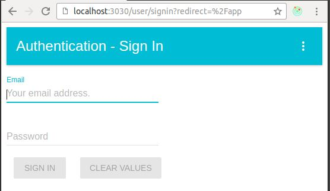
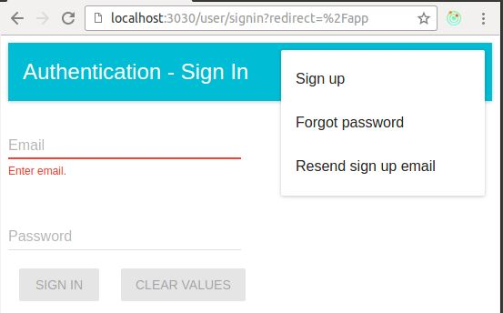
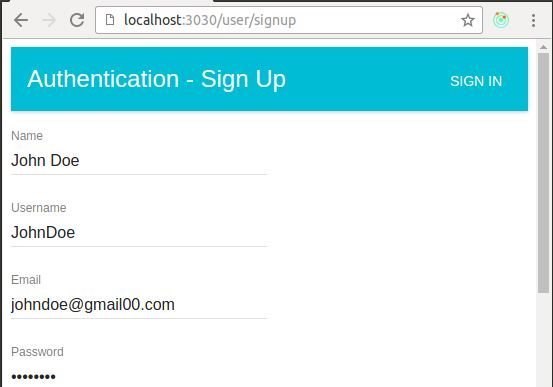
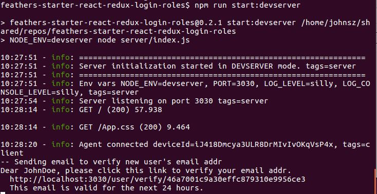
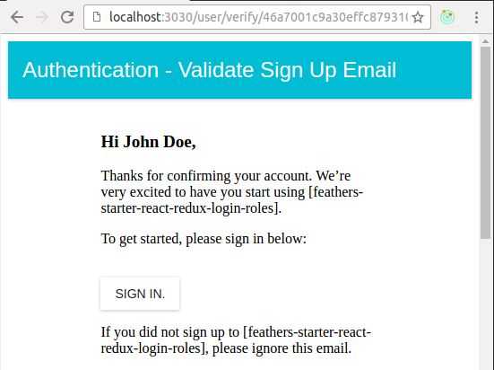
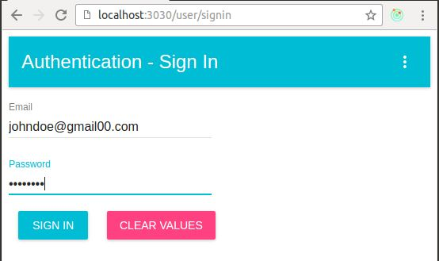
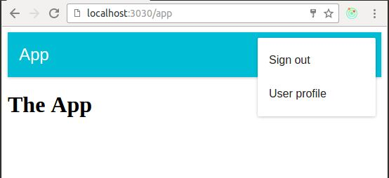
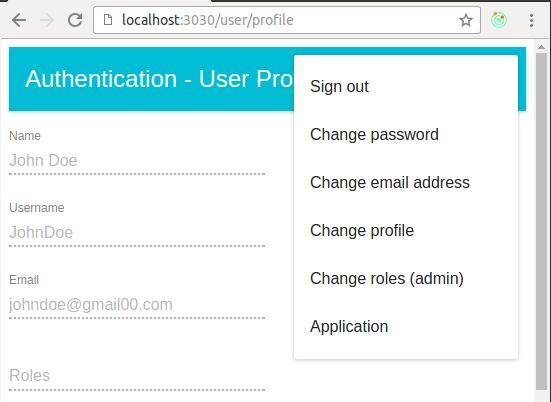
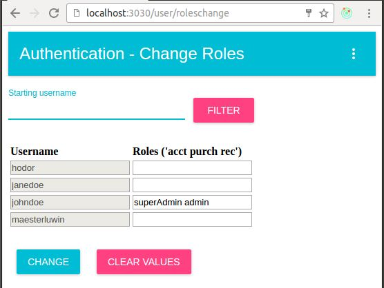

## FAQ

### Getting started
- [How do you start the server?](#start)
- [What should I do once the server starts?](#startGuide)

### Feathers and Redux
- [How compatible are Feathersjs services with Redux?](#feathersRedux)
- [Where are my action creators and reducers?](#reduxReducers)
- [How do I dispatch Feathers services?](#feathersDispatch)
- [How do I use .authentication() with Redux?](#feathersAuth)

### Configuration
- [How is the application configuration determined?](#configHow)
- [Tell me about the configuration values.](#config)
- [Tell me about configuration values for the client.](#configClient)
- [Tell me how the config is passed to code common to the server and client.](#configCommon)

### Database
- [Where is the data stored?](#dataWhere)

### Logging
- [Tell me about the logger.](#logging)
- [Tell me about logging from the client.](#loggingClient)
- [Why do the log entries contain JSON?](#logsJson)
- [Where are the logs stored?](#logsWhere)
- [How are the log files formatted?](#logsFmt)
- [How do you enable `debug` logging?](#debug)

### Packages
- [Are you using the latest version of Redux-form?](#reduxFormVer)
- [Why are you not using immutables for the user UI?](#reactImmutables)
- [Why are you not using React-Router v3 or v4?](#reactRouterVer)
- [Why you using a replacement for Redux DevTools?](#reduxDevTool)
- [Why does `Download the React DevTools for a better development experience:` appear on the console?](#reduxDevToolMsg)
- [Why have you not yet included React Hot Loader?](#reactHotLoader)

### Modules
- [Tell me about the Webpack config files.](#webpack)
- [Why would my Webpack chunks change hash values when no code changes?](#webpackChunks)
- [How can I build and use chunks anyway?](#webpackChunksBuild)
- [What were the criteria for module separation?](#designModules)
- [How can I tell if the most current `npm` packages are being used?](#npmVersions)

### Codes
- [Process Exit Codes.](#processExitCodes)
- [HTTP Status Codes.](#httpStatusCodes)

- [To do.](#todo)

==================

## <a name="start"></a> How do you start the server?

With Webpack-dev-server:
- `npm run build:devserver` on one process to start the webpack-dev-server on port 8080.
- `npm run start:devserver` to start the server on port 3030.
- Point browser to `localhost:3030` to start app.


Development build:
- `npm run build:dev`.
- `npm start:dev`.
- Point browser to `localhost:3030` to start app.

Production build:
- `npm run build`.
- `npm start`.
- Point browser to `localhost:3030` to start app.

User authorization features accessible from icon menus on `/user/signin` and `/app`.

## <a name="startGuide"></a> What should I do once the server starts?

- [ ] Point the browser at `localhost:3030`.
- [ ] You should soon see the sign in screen. 
- [ ] Click the menu icon; click Sign up. 
- [ ] Create a user. 
Since this is the first user, it will be assigned admin and superAdmin roles.
- [ ] The server console will display a placeholder transactional email meant to verify
the email address you entered. 
- [ ] Point the browser at the URL in that email.
- [ ] You should soon be greeted by a welcome screen. 
Click sign in.
- [ ] Sign in. 
- [ ] The root page of the App should soon appear. 
- [ ] Point the browser once more at `localhost:3030`.
- [ ] Your credentials were in localStorage, so you are automatically authenticated.
- [ ] You should be correctly identified in the log entry on the console. 
- [ ] The root page of the App appears.

Other parts of the local auth UI:

- [ ] Menu icon on sign in page has options for sign up, forgotten password,
and resending the email address verification email.
- [ ] Menu icon on main App page has an option for User profile.
- [ ] Menu icon on User profile page has other options.  

Note that only users with an admin role may modify users' roles.

==================

## <a name="feathersRedux"></a> How compatible are Feathersjs services with Redux?

Feathers services are wrapped to be 100% compatible with Redux.
The Redux action creator API is identical to that of the unwrapped Feathers service API,
so there is no learning curve.

```javascript
import { app, feathersServices } from '/client/feathers';
// 'raw' Feathers service call directly to server
app.service('/users').create(values)
// Feathers service call dispatched through Redux
dispatch(feathersServices.users.create(values))
```

Redux constants, actions, and reducers are internally generated.
A slice of state is allocated for each service and you may use it like any other Redux state.

```javascript
// Feathers service users
rootState.users = {
    isLoading: Boolean, // pending get, find
    isSaving: Boolean, // pending other methods
    isFinished: Boolean,
    queryResult: Object|null, // results of find
    data: Object|null, // results of other methods
    isError: Error|String|null, // why rejected
};
```

## <a name="reduxReducers"></a> Where are my action creators and reducers?

Action creators and reducers are dynamically created for Feathers services.
You don't see them in the folder structure because they are not code stored in files.

Here's how you create and use them:

```javascript
// List your Feathers services in /client/feathers/feathersServices.js
export const mapServicePathsToNames = {
  users: 'users',
  '/verifyReset/:action/:value': 'verifyReset', // Feathers path : name we'll use with Redux
};

// /client/feathers/index.js is coded to create the action creators and reducers for you
import reduxifyServices from 'feathers-reduxify-services';
export const feathersServices = reduxifyServices(app, mapServicePathsToNames);

// Add the reducers to Redux in /client/reducers.js
import { feathersServices, feathersAuthentication } from '/client/feathers';
export default {
  routing: routerReducer,
  auth: feathersAuthentication.reducer, // feathers-client.authenticated() is also Reduxified
  users: feathersServices.users.reducer,
  verifyReset: feathersServices.verifyReset.reducer,
};

// Dispatch using the action creators. Also find, get, update, patch, and remove.
import { feathersServices } from '/client/feathers';
const values = { email: 'JohnDoe@gmail00.com', password: '1234567890' };
dispatch(feathersServices.users.create(values)) // Same arguments as Feathers' create method.
    .then(() => {}) // method call successful
    .catch(err => {}); // method call rejected
```

Simple, huh?

## <a name="feathersDispatch"></a> How do I dispatch Feathers services?

### The short version

- Add your service name to `/client/feathers/feathersServices.js`
- Add your service name to `/client/reducers.js`.
- Add `import { feathersServices } from '/client/feathers';` to your module.
- You can now run `dispatch(feathersServices.users.create(...)).then(...)`.
- As well as `find`, `get`, `update`, `patch` and `remove`.

Redux actions will be dispatched for `pending`, `successful` and `rejected` as needed.
The slice of state allocated for this service will be updated for each action.

### A longer version

You can add a new user with

```javascript
import { feathersServices } from '/client/feathers';

const values = { email: 'JohnDoe@gmail00.com', password: '1234567890' };
dispatch(feathersServices.users.create(values))
    .then(() => {
      alert(
        `A confirmation email has been sent to ${values.email}. ` +
        `It is valid for the next ${config.authEmails.expires.signUpEmailTokenTimeValidText}.`
      );
      dispatch(push('/user/signin'));
    });
```

Redux state will reflect this service call is in progress.
You can render a notification of this, for example `users is saving`:

```javascript
// A message bar component to display the current state of Feathers services
import { getFeathersStatus } from '/client/feathers';

const MessageBar = ({ servicesRootState }) => {
  const barMessage = getFeathersStatus(servicesRootState).message;

  return !barMessage ? <div /> : <RaisedButton label={barMessage} disabled fullWidth />;
};

const mapStateToProps = (state) => ({
  servicesRootState: state,
});
export default connect(mapStateToProps)(MessageBar);
```

### The full story

See [feathers-reduxify-services](https://github.com/eddyystop/feathers-reduxify-services).

## <a name="feathersAuth"></a> How do I use .authentication() with Redux?

Feathers.authentication is automatically wrapper to be Redux compatible.

You can, for example, try authenticating with the stored JWT:

```javascript
import { feathersAuthentication } from '/client/feathers'
if (localStorage['feathers-jwt']) {
  store.dispatch(feathersAuthentication.authenticate())
    .then(...)
    .catch(...);
}
```

==================

## <a name="configHow"></a> [How is the application configuration determined?](../config/CONFIG_README.md)?

## <a name="config"></a> Tell me about the configuration values.

`/config/default.js` and `.env` are well commented.

The server configuration is frozen with `Object.freeze()`
after being calculated because of security considerations.

## <a name="configClient"></a> Tell me about configuration values for the client.

The configuration includes a section which identifies which parts of the complete configuration
is sent to a client when it starts up.

The client loads the configuration on start up using Feathers service `/config`.
The configuration is then frozen with `Object.freeze()`
because of security considerations.

## <a name="configCommon"></a> Tell me how the config is passed to code common to the server and client.

I wish we did something clever, but we don't.

`/server/index.js` and `/client/index.js` call each common module passing the correct config.
The module is expected to retain a reference to the config.
You will have to add to these calls for your own common code.

Lemme know if you have a better idea.

==================

## <a name="dataWhere"></a> Where is the data stored?

Production files are in `/data`.
Development and devserver files are in `/data-dev`.

This allows you to switch between test and production quality by changinf NODE_ENV.
*Be careful* should your production files be the actual live ones.

==================

## <a name="logging"></a> Tell me about the logger.

The logger uses [Winston](https://github.com/winstonjs/winston) and
[Morgan](https://github.com/expressjs/morgan).
It logs to both a log file and the console in production mode,
the console only in development.
You can control the severity of the entries logged with LOG_LEVEL and LOG_CONSOLE_LEVEL.

You can configure the logger in `server/utils/loggerProduction.js`.

## <a name="loggingClient"></a> Tell me about logging from the client.

The client can write log entries to the server's log file and console
using the Feathers service `/logs`.
A convenience wrapper makes it particularly easy to write logs from any place.

```javascript
import { logger } from '/client/utils/loggerRedux';
logger('info', 'Agent connected', { data: {...} });
```

Each device is identified by a 30 char slug in `localStorage.deviceId`.
This is added to the log along with the authenticated user's email and username,
if there is an authenticated user.

In summary the following is added to client log entries:
`deviceId: '...', user: { email, username }, tags: 'client'`.


## <a name="logsJson"></a> Why do the log entries contain JSON?

So they are easier to parse when you search them.

## <a name="logsWhere"></a> Where are the logs stored?

Production log files are in `/log`.

Development and devserver log files are in `/log-dev`.
You won't typically find any files there though as the dev modes do not write log files,
they log only onto the console.

You can made dev modes write files in `/log-dev` by change `server/utils/loggerProduction`
from `if (isProduction)` to `if (true)`.

## <a name="logsFmt"></a> How are the log files formatted?

To do.

```javascript
level: error, warn, info, verbose, debug, silly
"message":"Uncaught exception. Exiting."
data: {}
error: { code: processExitCode }
error: {"code":"EADDRINUSE","errno":"EADDRINUSE","syscall":"listen","address":"::","port":3030}
error: {
    "message":"tryit is not defined",
    "stack":[
        "ReferenceError: tryit is not defined",
        "    at EventEmitter.module.exports (/home/johnsz/shared/repos/feathers-starter-react-redux-login-roles/server/services/index.js:60:9)",
        "    at EventEmitter.configure (/home/johnsz/shared/repos/feathers-starter-react-redux-login-roles/node_modules/feathers/lib/application.js:138:8)",
        "    at Object.<anonymous> (/home/johnsz/shared/repos/feathers-starter-react-redux-login-roles/server/app.js:59:4)",
        "    at Module._compile (module.js:541:32)",
        "    at Object.Module._extensions..js (module.js:550:10)",
        "    at Module.load (module.js:458:32)",
        "    at tryModuleLoad (module.js:417:12)",
        "    at Function.Module._load (module.js:409:3)",
        "    at Module.require (module.js:468:17)",
        "    at require (internal/module.js:20:19)"
    ]},
    "tags":"exit",
    "level":"error",
    "message":"Uncaught exception. Exiting.",
    "timestamp":"2016-09-25T10:41:01.929Z"
}
timestamp: new Date()

server logs
tags: server, exit

client logs
tags: client
deviceId:
users: { email, username }
```

## <a name="debug"></a> How do you enable `debug` logging?

An environment variable is used to enable the `debug` logs based on space or comma-delimited names.
- On the server you use the DEBUG environment variable `DEBUG=verify* npm start`.
- On the client run `localStorage.debug = 'reducer*,verify*';`
on the console and then restart the client.

==================

## <a name="reduxFormVer"></a> Are you using the latest version of [Redux-form](https://github.com/erikras/redux-form)?

Redux-form was rewritten for v6 to be faster on large forms.
There is no incremental upgrade path from v5.
You need not worry as everything here is v6, the lastest and greatest.

## <a name="reactImmutables"></a> Why are you not using immutables for the user UI?

The user UI is rendered using Redux-Form, which itself reduces re-rendering.
Redux-Form ensures only the field being changed gets re-rendered, not the entire form.

This does not prevent you from using immutables in other slices of the state.

## <a name="reactRouterVer"></a> Why are you not using React-Router v3 or v4?

As of Sept. 2016, the version that will someday be 3.0.0 is still in beta
and its a significant change to v2.
Meanwhile a beta version of v4, a complete conceptual redesign, is also out.

The amount of churn is React-Router is [well known](https://news.ycombinator.com/item?id=12511419).

We have decided to remain on v2 for now. Later switching to v3,
which the devs say will continue to be maintained.
As developers writing practical software, we need some project stability.

## <a name="reduxDevTool"></a> Why you using a replacement for [Redux DevTools](https://github.com/gaearon/redux-devtools)?

We were happy enough with Redux DevTools in the past, but we feel the new
[Redux DevTools Extension](https://github.com/zalmoxisus/redux-devtools-extension)
is a superior product if you use Chrome, Firefox or Electron for development.

- Redux-devtools-extension resides in the browser, not in your client bundle.
- The integration requires just 1 line of JavaScript in your app.
It does not bloat your client bundle.
- Its UI is external to your app UI.
You don't have to import and render Redux-devtools-dock-monitor and Redux-devtools-log-monitor.
- You can use it for debugging even with production builds!
- You can use [Redux DevTools](https://github.com/gaearon/redux-devtools) are a fallback,
but not both simultaneously.
- You can use it with isomorphic (universal) apps.
- You can use it with React Native, hybrid, desktop and server side Redux apps.
- You simplify your webpack.config and avoid at least one obscure Redux-DevTool bug,
see http://stackoverflow.com/questions/28519287/what-does-only-a-reactowner-can-have-refs-mean/32444088#32444088

You can change `client/store.js` and `client/router/index.js` to use
[Redux DevTools](https://github.com/gaearon/redux-devtools)
if you want to.

## <a name="reduxDevToolMsg"></a> Why does `Download the React DevTools for a better development experience:` appear on the console?

You did not choose to use Redux DevTools.
You may be using Redux DevTools Extension, which is this project's default.

In any case this message is just an informatory message and no cause for concern.

## <a name="reactHotLoader"></a> Why have you not yet included [React Hot Loader](https://github.com/gaearon/react-hot-loader)?

We've used React Hot Loader.
Its author says it
[has problems](https://medium.com/@dan_abramov/the-death-of-react-hot-loader-765fa791d7c4#.er68udy3b)
and his
[React Transform Boilerplate](https://github.com/gaearon/react-transform-boilerplate)
should be used instead.
However that project has been _deprecated_.

React Hot Loader v3 is on the horizon and will fix some long-standing issues with both.
So we are waiting on on it.

_There may already be commented out code to include React Hot Loader._ Include your own if not.

https://medium.com/@rajaraodv/webpacks-hmr-react-hot-loader-the-missing-manual-232336dc0d96#.nulsvwntw

==================

## <a name="webpack"></a> Tell me about the Webpack config files.

### Why two?

`webpack.devserver.config.js` is for use with webpack-dev-server.
`webpack.production.config.js` is for development and production builds.

A production grade webpack config is more complex that what is needed for webpack-dev-server.
We feel its less error prone to have 2 configs
rather than use conditionals in a combined config.

### Why all the comments in the production config?

Webpack is great. However its grown complex and there are gotchas with certain plugins.

We sometimes feel its configs are a constant WIP.
Therefore the config includes comments which hopefully help in modifying it if needed.

## <a name="webpackChunks"></a> Why would my Webpack chunks change hash values when no code changes?

Webpack cannot produce chunks with a stable chunk hash as of June 2016.
The problem revolves around Webpack assigning numeric ids to modules.
A new module, or any change in module discovery order, can change subsequent ids,
and hence the 'code' for a chunk whose contents have not themselves changed.
At present there seem to be 2 fragile routes to try and avoid this problem,
but they don't work much of the time.
So we aren't implementing them.

More info:
- See Jan 15 posting in https://github.com/webpack/webpack/issues/1315
- See https://github.com/kevinrenskers/chunkhash-problem/commit/3969b5ac2233a933fe35b1338106cc13fd7caddb
(but it turns out CSS changes will still change the hash.)
- See NamedModulesPlugin option also.

One of the main uses of a chunk is to contain infrequently changed code.
The browser should then retrieve that chunk from its cache
instead of making a network request to the server.
Webpack at the moment cannot accomplish this.
Expect all the chunks to be requested when any code or CSS changes.

Chunks are still useful for dynamically loaded code.
The app can load infrequently used chunks only when they are needed.
It saves initial parsing time and may make the first page appear faster.

Webpack is undergoing a rewrite and this will hopefully be fixed.
However we'll also have to wait till every Webpack plugin is rewritten.

## <a name="webpackChunksBuild"></a> How can I build and use chunks anyway?

### Just chunks

If you want webpack to build chunks and have them all loaded through HTML,
then uncomment the lines dealing with chunks in `webpack.production.config.js`.

`HtmlWebpackPlugin` will insert the chunks into the HTML it generates.
However *do not* uncomment the `excludeChunks: ['user']`.

### Also dynamic loading

The `user` chunk does not include the Signin screen,
and the other user screens should be used often.
There is an argument that perhaps the `user` chunk should be loaded dynamically,
only when needed.
However the `user` chunk is small and you can argue the extra complexity of dynamic loading
is not worth the small improvement of displaying the first page.

You can enable dynamic loading by:
- Uncomment `excludeChunks: ['user']` in the webpack config
so the user chunk is not added to the HTML.
- You can change the code in `/client/router/js` to load the user chunk
as shown in the commented out code.

## <a name="designModules"></a> What were the criteria for module separation?

- Structure the modules the way React, Redux projects tend to structure them.
- Separate code you are unlikley to change from code you will have to customize for your app.

## <a name="npmVersions"></a> How can I tell if the most current `npm` packages are being used?

- Install the package `npm install -g npm-check-updates`.
- Run `npm-check-updates` or `npm run npm:updates` while in project root.

==================

## <a name="processExitCodes"></a> [Process Exit Codes.](./doc/PROCESS_EXIT_CODES.md)

## <a name="httpStatusCodes"></a> [HTTP Status Codes.](./doc/HTTP_STATUS_CODES.md)

==================

## <a name="todo"></a> To do

- [ ] Hot loader.
- [ ] HTTPS
- [ ] Professional samples of transactional emails.
- [ ] Validate server config on load using Joi.
- [ ] More docs on how to start adding an app.
- [ ] Sample tests for React components.
- [ ] Sample tests showing various fakes.
